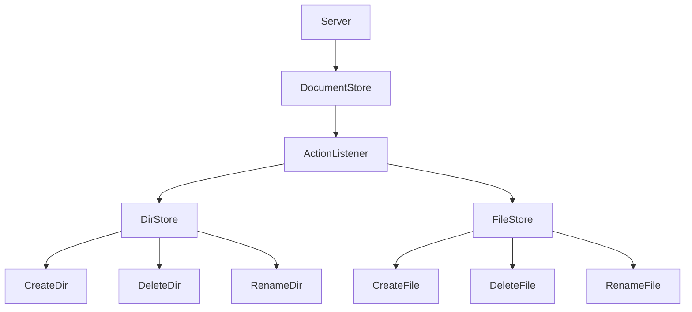
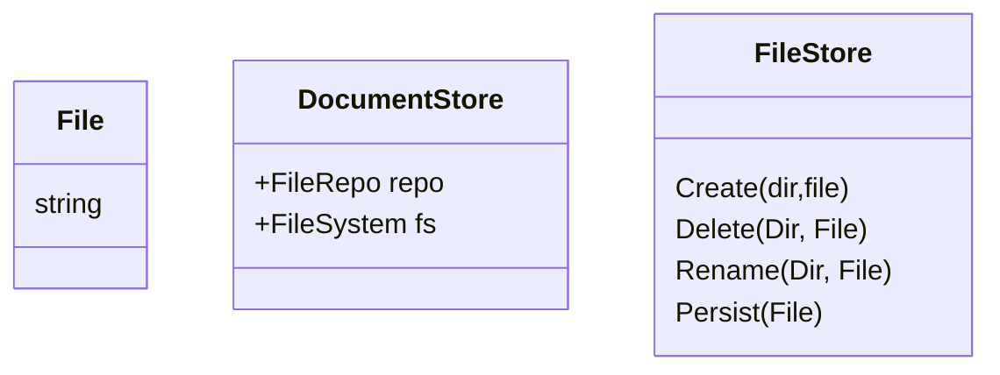

# Infrastructure

* **UI**: Handles structure using recursive structures `[File, Dir]` from `FileSystem` implementation of the `DocumentStore` package.
* **Server**: Recieves a struture `Dir{}` from UI via HTTP that contains Directory Structure and data; processess it through persistence layer called `FileStore`.
	* * **FileSystem & FileRepo**: 
		* Part of the DocumentStore package.
		* Document Oriented System.
			* `Sync() error` Translates from Layout to Persistence.
				* This helps limit file calls and possible errors on writing or reading.
			* `Load(path) error` Loads the lastest structure state to preffered format. 
			* `Save(path) error` Serializes the latest structure state from preffered format file.

	* **FileSystem**:
		* Manages layout or structure of directory.
		* Modify state of FileSystem with:
			* `New [Dir, File]`
			* `Remove [Dir, File]`
			* `Rename [Dir, File]`
			* `Update [File] `

	* **FileStore**: 
		* In charge of persisting and managing documents on the machine's filesystem.
		* Controlled based on FileSystem structure.
		* Persist state of FileSystem with:
			* `Create [Dir, File]`
			* `Delete [Dir, File]`
			* `Rename [Dir, File]`
			* `Persist [File]`

	* **Action Listener**
		* Listens for messages from FileSystem section of the UI and processess them server side with FileStore.
		* Independant systems. Interfaces dictate flow of communication.
		* If interface implementation is for web, Persistence side needs a `HttpHandler` and FileSystem side needs an `HttpClient`.
		* If interface implementation is for application, communication can be done through channels.

---
